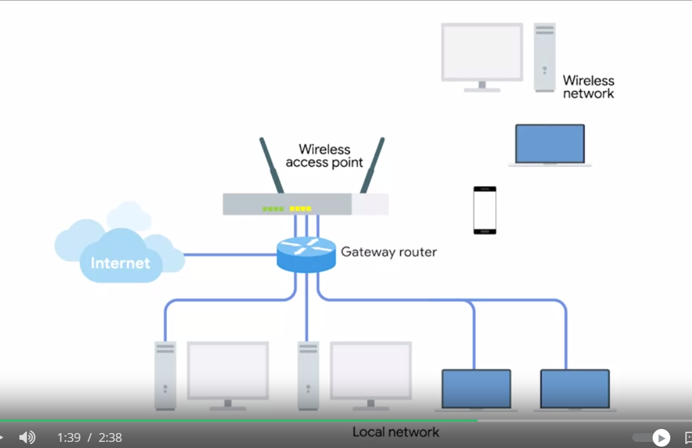

# Wireless Network Configurations

- Ad-hoc networks
- Wireless LANS or WLANS
- Mesh networks

## Ad-hoc network

> Simplest of the three.

In an ad-hoc network, there isn't really any supporting network infrastructure.

Every device involved with the network communicates with every other device within range, and all nodes help pass along messages.

Sometimes used in industrial or warehouse settings where individual pieces of equipment might need to communicate with each other, but not with anything else.

Powerful tools during disaster situations. If a natural disaster like an earthquake or hurricane knocks out all of the existing infrastructure in an area, disaster relief professionals can use an ad-hoc network to communicate with each other while they perform search and rescue efforts.

## WLANS

> The most common type of wireless network.

A wireless LAN consists of one or more access points which act as bridges between the wireless and wired networks.

The wired LAN contains the outbound Internet link. In order to access resources outside of the WLAN, wireless devices would communicate with access points. They then forward traffic along to the gateway router where everything proceeds like normal.

## Mesh network

> Like ad-hoc networks, since lots of the devices communicate with each other wirelessly, forming a mesh.

If you were to draw lines for all the links between all the nodes, most mesh networks you'll run into are made up of only wireless access points, and will still be connected to a wired network. This network lets you deploy more access points to the mesh without having to run a cable to each of them. With this setup, you can really increase the performance and range of a wireless network.