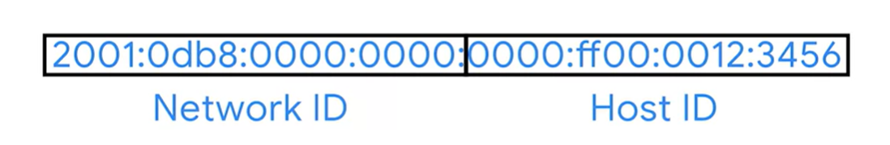

# IPv6 Addressing and Subnetting

An IPv6 is a 128 bit number, which then is divided into 8 part, each part contains 4 hexadecimal number.

**Example:** 2001:0db8:0000:0000:0000:ff00:0012:3456

### **Rules to shorten this**

- remove all leading `0` in each part
**Example:** 2001:db8:0:0:0:ff00:12:3456
- any consecutive part with all `0` can be replaced with `::`
**Example:** 2001:db8::ff00:12:3456

> `127.0.0.1 (IPv4) = ::1 (IPv6)`

