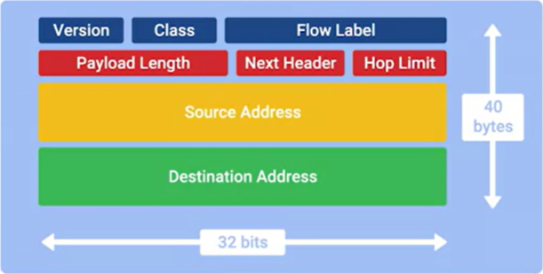

# IPv6 Headers

- **Version field**: A 4-bit field that defines what version of IP is in use.
- **Traffic class field**: An 8-bit field that defines the type of traffic contained within the IP datagram, and allow for different classes of traffic to receive different priorities.
- **Flow label field**: A 20-bit field that's used in conjunction with the traffic class field for routers to make decisions about the quality of service level for a specific datagram.
- **Payload length field**: A 16-bit field that defines how long the data payload section of the datagram is.
- **Next header field**: An unique concept of IPv6, and needs a little extra explaination. IPv6 is too long that it has to separate the header data and move all option fields to next header. Each of these additional optional headers contain a next header field and allow for a chain of headers to be formed if there's a lot of optional configuration.
- **Hop limit field**: An 8-bit field that's identical in purpose to the TTL field in an IPv4 header.

