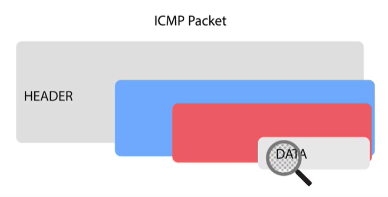
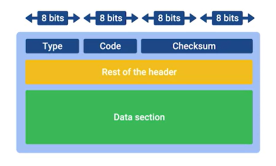

# Ping: Internet Control Message Protocol

ICMP is mainly used by a router or remote host to communicate why transmission has failed back to the origin of the transmission.

The ICMP packet has a header with a few fields and a data section that's used by a host to figure out which of their transmissions generated the error.

The first field is the type field, eight bits long, which specifies what type of message is being delivered.

Immediately after this is the code field which indicates a more specific reason for the message than just the type.

Rest of the header: a 32  bit field optionally used by some of the specific types and codes to send more data.

The payload for an ICMP packet exists entirely so that the recipient of the message knows which of their transmissions caused the error being reported.

> `Ping`  
Ping lets you send a special type of ICMP message called an **Echo Request**.  
 
If the destination is up and running and able to communicate on the network, it'll send back an ICMP **Echo Reply** message type.